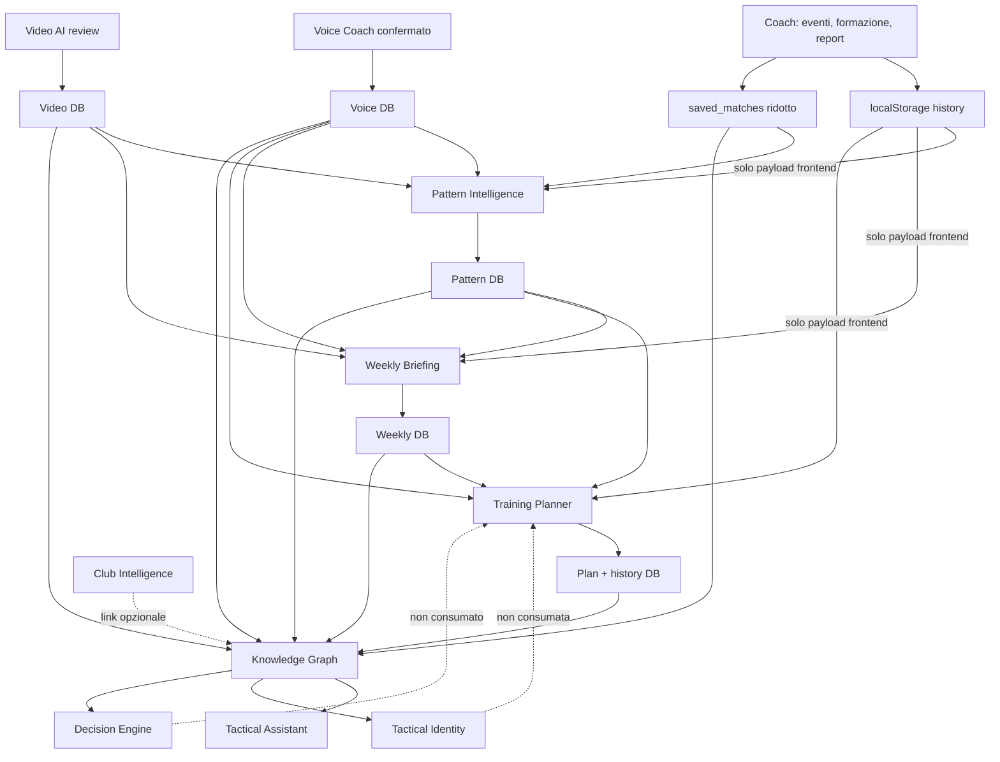
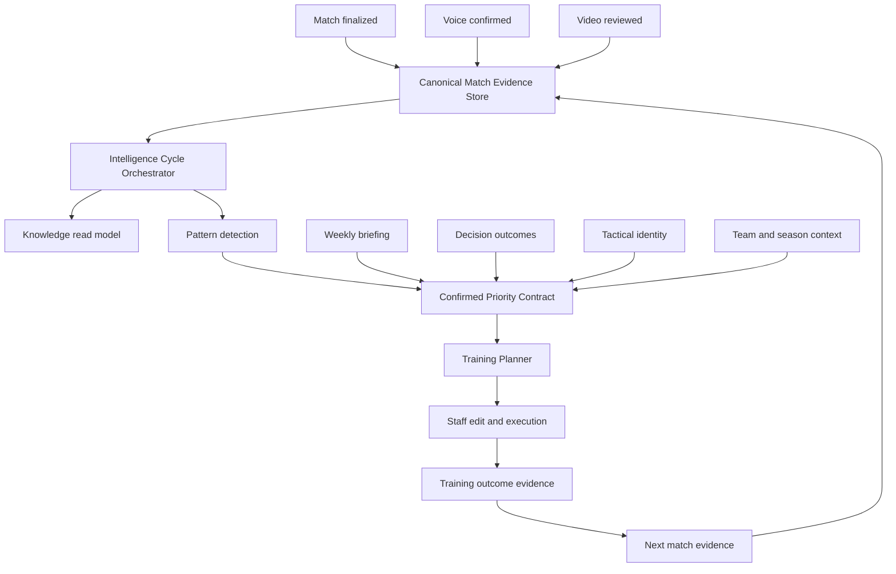

# MatchIQ Intelligence Connectivity Audit

**Data audit:** 2026-07-28
**Perimetro:** repository MatchIQ Tactical esistente
**Metodo:** analisi statica di frontend, router FastAPI, servizi, repository, schema dati e test esistenti
**Vincolo:** nessuna modifica applicativa, nessun commit, nessun push

---

## 1. Executive summary

La risposta alla domanda centrale e:

> **PARTIAL**

Dopo piu partite salvate, MatchIQ puo produrre una proposta settimanale basata
su evidenze della squadra e pattern storici, ma oggi il ciclo funziona in modo
affidabile solo quando:

1. le partite Coach sono state registrate sullo stesso browser;
2. l'utente apre manualmente Pattern Intelligence;
3. il frontend invia la cronologia locale nel payload;
4. il pattern viene calcolato e salvato;
5. l'utente apre o genera Weekly Briefing;
6. l'utente apre Training Planner e genera il piano.

Il ciclo non e ancora automatico e non e interamente cloud. Il primo punto di
rottura e il salvataggio della partita Coach: eventi, pagelle, formazione,
report e osservazioni operative sono mantenuti principalmente in
`localStorage`, mentre `saved_matches` conserva una rappresentazione molto piu
povera della partita.

Il prodotto contiene gia moduli reali e persistenti per Voice Coach, Video AI,
Pattern Intelligence, Weekly Briefing, Training Planner, Knowledge, Tactical
Assistant, Tactical Identity, Decision Engine e Club Intelligence. Non serve
ricostruirli. Serve collegarli attraverso un contratto canonico e un
orchestratore idempotente.

### Conteggio sintetico

| Classificazione | Numero | Nota |
|---|---:|---|
| Intelligenze reali e raggiungibili | 11 | Tutti i moduli inventariati hanno codice e route reali |
| `PRODUCTION` | 2 | Voice Coach, Video AI |
| `PARTIAL` | 7 | Coach, Weekly, Pattern, Training, Knowledge, Assistant, Identity |
| `ACTIVE_BUT_ISOLATED` | 2 | Decision Engine, Club Intelligence |
| `MOCK` / `DOCUMENTED_ONLY` | 0 | Nessun modulo principale e solo documentazione |

La libreria esercizi del Training Planner e reale e persistente, ma contiene
contenuti seed editoriali con stato `reviewed_demo`. Il piano e specifico per
tema e vincoli di seduta, non ancora profondamente personalizzato sul profilo
completo della squadra.

---

## 2. Verdetto sul ciclo richiesto

### Domanda

> Dopo una o piu partite salvate, MatchIQ puo produrre una proposta settimanale
> basata sulle evidenze della squadra, sui pattern storici e sulle priorita
> confermate dall'allenatore?

### Risposta: PARTIAL

**Cosa funziona:**

- Pattern Intelligence aggrega eventi Coach locali, Voice Coach confermato,
  feedback Video AI e report video.
- I pattern vengono persistiti e possono essere confermati dallo staff.
- Weekly Briefing usa fonti cloud e fonti Coach locali.
- Training Planner usa pattern, briefing, Voice Coach e cronologia Coach locale.
- Il piano viene salvato, versionato, modificato e mantenuto nello storico.

**Cosa impedisce un YES:**

- il dettaglio Coach non diventa automaticamente una fonte cloud canonica;
- non esiste un trigger `match_finalized` che avvii il ciclo;
- Pattern, Weekly e Training sono eseguiti su richiesta;
- gli identificatori partita/squadra/stagione non sono uniformi;
- Decision Engine, Tactical Identity e Club Intelligence non alimentano il
  Training Planner;
- non esiste un ciclo chiuso tra piano eseguito, partita successiva e impatto.

### Prima interruzione precisa

```text
Coach salva partita
  -> eventi/report/formazione/pagelle in localStorage
  -> saved_matches cloud contiene solo dati ridotti
  X nessun evento canonico "match_finalized"
  X nessuna sincronizzazione automatica delle evidenze dettagliate
```

Prove:

- `frontend/js/coach-state.js:2-9`
- `frontend/js/coach-storage.js:3-11`
- `database.py:278`
- `database.py:446`
- `app/services/pattern_intelligence_aggregator.py:53-110`

---

## 3. Inventario completo delle intelligenze

Ogni voce usa gli stessi 17 campi: stato, UI, API, router, servizio, repository,
persistenza, input, output, provider, trigger, consumatori, identificatori,
fallback, test, prova, gap.

### 3.1 Coach AI

1. **Stato:** `PARTIAL`.
2. **Entrypoint UI:** `frontend/coach.html`.
3. **API:** salvataggi cloud ridotti e tracking Coach; il workspace operativo
   completo resta client-side.
4. **Router:** `app/routers/coach_tracking.py` e route correlate in `main.py`.
5. **Servizio:** logica operativa distribuita nei moduli `frontend/js/coach-*`.
6. **Repository:** nessun repository cloud canonico per lo stato completo Coach.
7. **Persistenza:** `localStorage` con `matchiq_coach_v13` e
   `matchiq_coach_history_v14`; tabella `saved_matches` per dati ridotti.
8. **Input:** setup, formazione, eventi, voti, note, comandi vocali.
9. **Output:** timeline, report, memoria partita, storico locale.
10. **Provider AI:** nessun provider necessario per il salvataggio operativo.
11. **Trigger:** azioni esplicite dell'utente.
12. **Consumatori:** Pattern, Weekly e Training solo tramite payload locale;
    Knowledge vede principalmente `saved_matches`.
13. **Identificatori:** ID locali generati dal browser e ID DB non sempre
    coincidenti.
14. **Fallback/errori:** lo storico locale rende l'app utilizzabile offline, ma
    non garantisce continuita cross-device.
15. **Test:** numerosi test Coach/PWA/polish, nessun E2E cloud del ciclo completo.
16. **Prova:** `coach-storage.js:3-11`, `coach-state.js:2-9`.
17. **Gap:** il patrimonio tattico piu ricco non e una fonte cloud canonica.

### 3.2 Voice Coach

1. **Stato:** `PRODUCTION`.
2. **Entrypoint UI:** sezione Voice Coach in `frontend/coach.html`.
3. **API:** `/api/coach/voice`.
4. **Router:** `app/routers/coach_voice.py:29-80`.
5. **Servizio:** `app/services/voice_coach_intelligence_service.py`.
6. **Repository:** repository Voice Coach dedicato.
7. **Persistenza:** osservazioni, temi, conferme e stato in database.
8. **Input:** comando vocale/testuale, contesto partita, conferma staff.
9. **Output:** osservazione strutturata e temi ricorrenti.
10. **Provider AI:** parsing/normalizzazione del servizio; nessun requisito LLM
    nel collegamento downstream.
11. **Trigger:** comando utente e conferma.
12. **Consumatori:** Pattern, Weekly, Training, Knowledge.
13. **Identificatori:** `user_id`, `match_id` o `match_key`, observation ID.
14. **Fallback/errori:** osservazioni non confermate non devono pesare come
    evidenza validata.
15. **Test:** `tests/test_voice_coach_intelligence.py`.
16. **Prova:** `voice_coach_intelligence_service.py:132+`.
17. **Gap:** il `match_key` non e sempre lo stesso ID usato da Coach e Video.

### 3.3 Video AI

1. **Stato:** `PRODUCTION`.
2. **Entrypoint UI:** `frontend/video.html`.
3. **API:** `/api/video` e `/api/video/intelligence`.
4. **Router:** `app/routers/video.py`, `app/routers/video_intelligence.py:33-264`.
5. **Servizio:** servizi Video Hub/Video Intelligence.
6. **Repository:** asset, report, feedback frame e sessioni video.
7. **Persistenza:** `video_assets`, `video_reports`,
   `video_frame_feedback`.
8. **Input:** video, contesto, frame, revisione staff.
9. **Output:** report, descrizioni, categorie, feedback e materiale revisionato.
10. **Provider AI:** OpenAI nelle fasi interpretative gia esistenti.
11. **Trigger:** upload e azioni esplicite dell'utente.
12. **Consumatori:** Pattern, Weekly, Knowledge; Assistant tramite Knowledge.
13. **Identificatori:** asset ID, report ID, frame ID; `match_id` opzionale.
14. **Fallback/errori:** senza `match_id` il sistema crea riferimenti sintetici
    `video:*` o `video-report:*`.
15. **Test:** suite `test_video_*`.
16. **Prova:** `database.py:360-419`, `database.py:528-587`.
17. **Gap:** l'ownership utente e solida, ma il collegamento alla partita Coach
    e opzionale.

### 3.4 Weekly AI Briefing

1. **Stato:** `PARTIAL`.
2. **Entrypoint UI:** pagina Weekly Briefing e card Home.
3. **API:** `/api/weekly-briefing`.
4. **Router:** `app/routers/weekly_briefing.py:14-28`.
5. **Servizio:** `app/services/weekly_briefing_service.py`.
6. **Repository:** `app/repositories/weekly_briefing_repository.py`.
7. **Persistenza:** tabella `weekly_ai_briefings`, unica per utente/settimana.
8. **Input:** fonti cloud e `local_sources` dal browser.
9. **Output:** sintesi, segnali positivi, priorita e azioni.
10. **Provider AI:** composizione deterministica nel servizio auditato.
11. **Trigger:** generazione quando l'utente apre/usa la pagina.
12. **Consumatori:** Training Planner, Home, Knowledge.
13. **Identificatori:** `user_id`, settimana, Knowledge workspace.
14. **Fallback/errori:** puo produrre un briefing limitato con fonti scarse.
15. **Test:** `tests/test_weekly_briefing.py`.
16. **Prova:** `weekly_briefing_repository.py:103-126`,
    `weekly_briefing_service.py:51-142`.
17. **Gap:** nessuna esecuzione settimanale automatica; parte delle fonti vive nel
    browser.

### 3.5 Pattern Intelligence

1. **Stato:** `PARTIAL`.
2. **Entrypoint UI:** `frontend/pattern-intelligence.html`.
3. **API:** `/api/pattern-intelligence`.
4. **Router:** `app/routers/pattern_intelligence.py:13-55`.
5. **Servizio:** aggregator, engine e service dedicati.
6. **Repository:** repository pattern, run ed evidenze.
7. **Persistenza:** run, pattern, evidence e stato staff in database.
8. **Input:** partite locali, saved matches, Voice, Video feedback/report.
9. **Output:** pattern candidato/consolidato, confidence, impatto e fonti.
10. **Provider AI:** regole deterministiche; nessun LLM richiesto.
11. **Trigger:** POST frontend esplicito.
12. **Consumatori:** Weekly, Training, Identity, Knowledge, Decision come
    contesto.
13. **Identificatori:** run ID, pattern ID, evidence ID, match ID eterogeneo.
14. **Fallback/errori:** con poche partite restituisce insufficienza o candidato.
15. **Test:** `tests/test_pattern_intelligence.py`.
16. **Prova:** `pattern_intelligence_aggregator.py:53-110`,
    `pattern_intelligence_engine.py:12-55`.
17. **Gap:** dipendenza dal payload `local_matches` e assenza di run automatico.

### 3.6 AI Training Planner

1. **Stato:** `PARTIAL`.
2. **Entrypoint UI:** `frontend/training-planner.html`.
3. **API:** `/api/training-planner`.
4. **Router:** `app/routers/training_planner.py:14-52`.
5. **Servizio:** aggregator, selector e service.
6. **Repository:** repository esercizi, piani e storico.
7. **Persistenza:** `training_exercises`, `training_plans`,
   `training_plan_history`.
8. **Input:** pattern, briefing, Voice, cronologia Coach locale, vincoli seduta.
9. **Output:** piano settimanale, sedute, esercizi, motivazioni e fonti.
10. **Provider AI:** algoritmo deterministico su libreria editoriale seed.
11. **Trigger:** pulsante di generazione/rigenerazione.
12. **Consumatori:** Home, Knowledge e staff.
13. **Identificatori:** plan ID, exercise ID, pattern run e weekly ID nel
    metadata/source link.
14. **Fallback/errori:** stato `insufficient` se non trova priorita.
15. **Test:** `tests/test_training_planner.py`.
16. **Prova:** `training_planner_aggregator.py:18-62`,
    `training_planner_service.py:24-74`,
    `training_planner_selector.py:5-35`.
17. **Gap:** non consuma Decision/Identity/Club e non chiude il ciclo di impatto.

### 3.7 MatchIQ Knowledge

1. **Stato:** `PARTIAL`.
2. **Entrypoint UI:** pagina Knowledge e link contestuali.
3. **API:** `/api/knowledge`, `/api/knowledge-intelligence`.
4. **Router:** `app/routers/knowledge_intelligence.py:16-84`.
5. **Servizio:** registry, adapters e sync.
6. **Repository:** Knowledge foundation e graph repository.
7. **Persistenza:** nodi, archi, versioni, timeline, tag, sync state, note.
8. **Input:** profili, saved matches, Voice, Pattern, Weekly, Training, Video,
   Scout.
9. **Output:** grafo ricercabile e source links.
10. **Provider AI:** nessuno richiesto.
11. **Trigger:** sync invocata dai servizi o dalla UI.
12. **Consumatori:** Tactical Assistant, Identity, Decision e viste Knowledge.
13. **Identificatori:** `workspace_id`, canonical key e source IDs.
14. **Fallback/errori:** `sync_module_safely` intercetta gli errori senza
    bloccare il modulo sorgente.
15. **Test:** `tests/test_knowledge_intelligence.py`.
16. **Prova:** `knowledge_intelligence_registry.py:4-88`,
    `knowledge_intelligence_sync.py:40-77`.
17. **Gap:** adapter Coach non materializza eventi/report/sessioni dichiarati
    nel registry; gli errori di sync sono silenziosi.

### 3.8 Tactical Assistant

1. **Stato:** `PARTIAL`.
2. **Entrypoint UI:** `frontend/tactical-assistant.html`.
3. **API:** `/api/tactical-assistant`.
4. **Router:** `app/routers/tactical_assistant.py:14-54`.
5. **Servizio:** orchestrator, retrieval e provider.
6. **Repository:** conversazioni, messaggi, fonti, feedback, telemetry.
7. **Persistenza:** database per tutte le conversazioni.
8. **Input:** domanda, contesto, fonti Knowledge.
9. **Output:** risposta con motivazione, limiti, opzioni e fonti.
10. **Provider AI:** OpenAI opzionale; fallback deterministico evidence-only.
11. **Trigger:** domanda dell'utente.
12. **Consumatori:** staff tecnico.
13. **Identificatori:** conversation ID, source IDs, workspace ID, match/team
    context.
14. **Fallback/errori:** rifiuta di inventare conoscenza esterna quando le fonti
    sono insufficienti.
15. **Test:** `tests/test_tactical_assistant.py`.
16. **Prova:** orchestrator e retrieval dedicati sotto `app/services/`.
17. **Gap:** la qualita dipende dalla copertura incompleta di Knowledge.

### 3.9 Tactical Identity

1. **Stato:** `PARTIAL`.
2. **Entrypoint UI:** `frontend/tactical-identity.html` e card contestuali.
3. **API:** `/api/tactical-identity`.
4. **Router:** router Tactical Identity incluso da `main.py`.
5. **Servizio:** sources, engine e service.
6. **Repository:** profili, dimensioni, evidenze, versioni e feedback.
7. **Persistenza:** database versionato.
8. **Input:** nodi Knowledge validati e affidabili.
9. **Output:** identita tattica, dimensioni e confidence.
10. **Provider AI:** calcolo deterministico.
11. **Trigger:** generazione/aggiornamento esplicito.
12. **Consumatori:** UI e contesto Decision/Assistant.
13. **Identificatori:** identity ID, workspace ID, evidence IDs.
14. **Fallback/errori:** confidence bassa con meno di circa tre partite.
15. **Test:** `tests/test_tactical_identity.py`.
16. **Prova:** `identity_sources.py`, `identity_engine.py`.
17. **Gap:** il Training Planner non usa ancora identita o filosofia.

### 3.10 AI Decision Engine

1. **Stato:** `ACTIVE_BUT_ISOLATED`.
2. **Entrypoint UI:** `frontend/decision-engine.html` e link contestuali.
3. **API:** `/api/decision-engine`.
4. **Router:** `app/routers/decision_engine.py:15-73`.
5. **Servizio:** service, source collector e options.
6. **Repository:** casi, opzioni, fonti, decisioni, outcome, telemetry.
7. **Persistenza:** database.
8. **Input:** contesto manuale e fonti Knowledge.
9. **Output:** opzioni, decisione staff e outcome.
10. **Provider AI:** template deterministici per fase.
11. **Trigger:** apertura e valutazione esplicita.
12. **Consumatori:** UI e Knowledge; non Training.
13. **Identificatori:** case ID, option ID, source IDs, workspace.
14. **Fallback/errori:** propone opzioni conservative con evidenze insufficienti.
15. **Test:** `tests/test_decision_engine.py`.
16. **Prova:** `decision_engine_service.py:28-71`,
    `decision_engine_options.py:7-36`.
17. **Gap:** decisioni e outcome non diventano priorita settimanali o vincoli
    del piano.

### 3.11 Club Intelligence

1. **Stato:** `ACTIVE_BUT_ISOLATED`.
2. **Entrypoint UI:** `frontend/club-intelligence.html`.
3. **API:** `/api/club-intelligence`.
4. **Router:** `app/routers/club_intelligence.py:20-67`.
5. **Servizio:** servizio Club Intelligence.
6. **Repository:** club, team, memberships, principi, risorse, snapshot, audit.
7. **Persistenza:** database.
8. **Input:** struttura organizzativa e principi del club.
9. **Output:** overview e snapshot organizzativi.
10. **Provider AI:** nessuno necessario.
11. **Trigger:** CRUD e snapshot espliciti.
12. **Consumatori:** UI Club; collegamento opzionale a Knowledge.
13. **Identificatori:** club ID, team ID, membership ID,
    `knowledge_workspace_id` opzionale.
14. **Fallback/errori:** opera senza workspace Knowledge collegato.
15. **Test:** `tests/test_club_intelligence.py`.
16. **Prova:** repository e router Club Intelligence.
17. **Gap:** team/rosa/principi non condizionano ancora il Training Planner.

---

## 4. Tracciamento frontend -> API -> service -> storage

| Modulo | Frontend | API | Service | Storage |
|---|---|---|---|---|
| Coach | `coach-*.js` | route Coach ridotte | prevalentemente client | localStorage + `saved_matches` |
| Voice | Coach live assistant | `/api/coach/voice` | Voice intelligence | DB Voice |
| Video | `video-*.js` | `/api/video*` | Video services | asset/report/feedback DB |
| Pattern | `pattern-intelligence-api.js` | `/api/pattern-intelligence/run` | aggregator -> engine -> service | pattern DB |
| Weekly | `weekly-briefing-api.js` | `/api/weekly-briefing/generate` | weekly service | weekly DB |
| Training | `training-planner-api.js` | `/api/training-planner/generate` | aggregator -> selector -> service | training DB |
| Knowledge | `knowledge-*.js` | `/api/knowledge-intelligence` | adapters -> sync | Knowledge graph DB |
| Assistant | `tactical-assistant-*.js` | `/api/tactical-assistant` | retrieval -> orchestrator | assistant DB |
| Identity | `tactical-identity-*.js` | `/api/tactical-identity` | sources -> engine | identity DB |
| Decision | `decision-engine-*.js` | `/api/decision-engine` | sources -> options -> service | decision DB |
| Club | `club-intelligence-*.js` | `/api/club-intelligence` | club service | club DB |

La catena e composta da implementazioni reali, ma il frontend svolge ancora il
ruolo di adapter fondamentale per trasferire lo storico Coach locale a Pattern,
Weekly e Training.

---

## 5. Diagramma del flusso attuale



---

## 6. Diagramma del flusso desiderato



Il database dei moduli resta source of truth. Knowledge diventa il read model
connesso, non il contenitore unico di ogni dato.

---

## 7. Matrice producer/consumer

| Producer | Contratto prodotto oggi | Consumer effettivo | Qualita collegamento |
|---|---|---|---|
| Coach | oggetto locale match/events/ratings/report | Pattern, Weekly, Training | Fragile, browser-dependent |
| `saved_matches` | shell partita | Pattern, Knowledge | Persistente ma povero |
| Voice | observation/theme confermato | Pattern, Weekly, Training, Knowledge | Buono |
| Video | asset/frame feedback/report | Pattern, Weekly, Knowledge | Buono, match link opzionale |
| Pattern | topic/confidence/evidence/status | Weekly, Training, Identity, Knowledge | Buono |
| Weekly | priorities/actions | Training, Home, Knowledge | Buono |
| Training | plan/sessions/exercises/status/version | Home, Knowledge | Buono in uscita |
| Identity | dimensions/confidence/evidence | UI/Assistant/Decision | Non consumato da Training |
| Decision | options/decision/outcome | UI/Knowledge | Non consumato da Training |
| Club | team/principles/resources | Club UI/Knowledge opzionale | Isolato dal ciclo |

---

## 8. Contratti incompatibili o incompleti

| Area | Incompatibilita | Effetto |
|---|---|---|
| Match ID | ID DB, ID locale, `match_key`, stringhe video sintetiche | Evidenze della stessa partita possono risultare separate |
| Team | `team_profile_id` Knowledge vs team ID Club | Il piano non eredita automaticamente rosa/principi |
| Season | prevalentemente testo libero, nessun ID condiviso | Storico stagionale fragile |
| Coach events | schema locale completo, cloud shell ridotta | Pattern dipende dal browser |
| Pattern -> Training | topic e metadata, non FK forti per ogni evidenza | Tracciabilita parziale |
| Video -> Match | `match_id` opzionale | Report e frame possono sembrare partite autonome |
| Decision -> Priority | nessun adapter | Decisione staff esclusa dal piano |
| Identity -> Training | nessun adapter | Piano non rispetta sempre filosofia/modulo |
| Club -> Training | nessun adapter | Disponibilita e risorse organizzative non entrano |
| Knowledge registry | dichiara Coach event/report/session | adapter Coach non li produce |

---

## 9. Persistenza e source of truth

| Dominio | Persistenza | Source of truth attuale | Valutazione |
|---|---|---|---|
| Coach current/history | localStorage | browser | Critico |
| Saved matches | DB | backend | Dato ridotto |
| Voice | DB | backend | Solido |
| Video | DB | backend/object storage | Solido |
| Pattern | DB | backend | Solido dopo il run |
| Weekly | DB | backend | Solido dopo generazione |
| Training | DB + history | backend | Solido |
| Knowledge | DB graph | read model derivato | Solido ma incompleto |
| Assistant | DB | backend | Solido |
| Identity | DB versionato | backend | Solido |
| Decision | DB | backend | Solido ma isolato |
| Club | DB | backend | Solido ma isolato |

Non esiste una coda o un job asincrono dedicato al ciclo intelligence. I moduli
sono request-driven. La sync Knowledge viene spesso invocata in modo sincrono e
protetto da `sync_module_safely`, che non propaga l'errore al modulo sorgente.

---

## 10. Capacita di analisi storica

L'analisi storica e **reale ma condizionata**:

- Pattern usa piu partite e richiede soglie minime di evidenza.
- Pattern distingue candidate e consolidated.
- Weekly puo usare il pattern storico piu recente.
- Training ordina le priorita in base a pattern, briefing, Voice e storico.
- Identity aumenta la confidence con una base partite piu ampia.

Il limite principale e che lo storico Coach dettagliato non e cloud-native.
Aprire Pattern da un altro dispositivo puo produrre un risultato diverso,
nonostante l'account sia lo stesso.

---

## 11. Pattern Intelligence

### Stato

`PARTIAL`, code-backed e persistente.

### Cosa fa bene

- normalizza evidenze da fonti multiple;
- usa soglie minime;
- deduplica via fingerprint;
- persiste run, pattern ed evidenze;
- consente conferma, archiviazione, dismiss e note staff;
- espone impatto e fonti.

### Cosa manca

- trigger automatico a partita finalizzata;
- feed Coach cloud completo;
- match ID uniforme;
- una tassonomia condivisa con Voice, Video e Training;
- confronto automatico dopo la partita successiva.

---

## 12. Decision Engine

### Stato

`ACTIVE_BUT_ISOLATED`.

Il modulo crea casi reali, opzioni, decisioni staff e outcome persistenti. Le
opzioni sono template deterministici e conservativi. Il problema non e la sua
esistenza: e l'assenza di un adapter che trasformi una decisione confermata o
un outcome in una priorita consumabile da Weekly e Training.

Oggi puo aiutare una decisione puntuale, ma non governa il ciclo settimanale.

---

## 13. Training Planner

### Riceve dati reali della partita?

**Si, ma non in modo completamente affidabile.**

Riceve:

- eventi Coach reali quando il browser invia `local_context.history`;
- pattern persistiti derivati da partite;
- priorita Weekly persistite;
- osservazioni Voice confermate.

Non riceve:

- eventi Coach cloud completi se il browser non li possiede;
- decisioni e outcome del Decision Engine;
- identita tattica come vincolo strutturale;
- dati Club/rosa/disponibilita reali;
- esiti dell'allenamento precedente.

### Il piano e specifico o generico?

E **specifico per tema, numero giocatori, portieri, intensita, categoria e
durata**, ma usa una libreria editoriale statica seed. Quindi e piu utile di un
piano generico casuale, ma non e ancora una prescrizione profondamente
individualizzata.

### Salvataggio e modifica

Il piano:

- conserva versione originale e corrente;
- e persistito;
- puo essere modificato;
- incrementa la versione;
- conserva storico e azioni;
- puo cambiare stato.

Questa parte e reale e ben strutturata.

---

## 14. MatchIQ Knowledge

Knowledge e una base reale, non un mock. Ha registry, adapter, grafo, versioni,
timeline, tag e source links.

Il suo ruolo corretto e:

- indicizzare fonti;
- offrire retrieval trasversale;
- rendere spiegabili Assistant, Identity e Decision;
- collegare oggetti gia persistiti altrove.

Non deve sostituire la persistenza canonica di Match, Training o Video.

Gap specifico: `MODULE_SOURCE_TYPES` dichiara `coach_session`, `event` e
`report`, ma l'adapter Coach legge sostanzialmente `saved_matches`. La promessa
del contratto e piu ampia dell'implementazione.

---

## 15. Tactical Assistant

Il Tactical Assistant usa retrieval su Knowledge, conserva conversazioni e
fonti e puo usare OpenAI. Quando le fonti sono insufficienti, produce un
fallback deterministico senza inventare conoscenza calcistica.

E una scelta architetturale corretta. Il limite e a monte: se gli eventi Coach
non entrano in Knowledge, l'Assistant non puo recuperarli.

---

## 16. Weekly Briefing

Weekly Briefing combina:

- Voice confermato;
- Video report e feedback;
- saved matches;
- pattern storico;
- fonti Coach locali inviate dal browser.

Salva un briefing per settimana e sincronizza Knowledge.

Il briefing non viene creato da un job settimanale. Viene generato quando
l'utente apre o aziona la relativa UI. Di conseguenza "Weekly" descrive il
periodo del contenuto, non ancora un'automazione temporale.

---

## 17. Coach e Voice Coach

Coach produce la fonte piu importante per MatchIQ: cio che lo staff ha visto
durante la gara.

La separazione attuale e:

- eventi e workspace Coach: soprattutto locali;
- osservazioni Voice strutturate: cloud e persistenti.

Questo crea una distorsione: una nota Voice confermata puo essere piu facilmente
riutilizzata dal ciclo rispetto a un evento Coach registrato con un pulsante.

La correzione non richiede cambiare la UX Coach. Richiede salvare, al termine
della partita, lo stesso patrimonio in forma canonica e idempotente.

---

## 18. Video AI

Video AI produce fonti utili:

- asset;
- frame;
- categoria;
- feedback staff;
- report.

Pattern e Weekly le leggono. La qualita del collegamento dipende da:

- presenza del `match_id`;
- stato di revisione;
- affidabilita della categoria;
- distinzione tra evidenza AI e conferma umana.

Quando manca `match_id`, una sorgente video puo aumentare artificialmente il
numero di "partite" viste dall'aggregatore. Va mantenuta l'evidenza, ma deve
essere collegata alla partita canonica.

---

## 19. Verifica dei sette scenari

### Scenario 1 - Una partita, note, nessun video

**Esito:** parziale.

Le note/eventi sono disponibili sullo stesso browser. Non bastano normalmente
per un pattern storico affidabile. Weekly puo estrarre segnali limitati. Un
piano puo risultare insufficiente o dipendere da priorita non storiche.

### Scenario 2 - Una partita, Video AI e frame confermati

**Esito:** parziale.

Video alimenta Pattern/Weekly/Knowledge. Una sola partita non consolida un
pattern. Se manca il match ID canonico, frame e report possono diventare fonti
sintetiche separate.

### Scenario 3 - Tre partite con lo stesso problema

**Esito:** funziona sullo stesso browser e con run manuale.

Pattern puo rilevare la ricorrenza, persisterla e renderla disponibile al
Training Planner. Cross-device non e garantito per gli eventi Coach.

### Scenario 4 - Pattern confermato dall'allenatore

**Esito:** funziona.

Lo stato staff viene persistito e il pattern confermato pesa come fonte forte.

### Scenario 5 - Due sedute da 90 minuti

**Esito:** funziona.

Il payload accetta giorni, durata, giocatori, portieri, categoria e intensita.
Il builder distribuisce priorita ed esercizi nelle sedute.

### Scenario 6 - L'allenatore modifica il piano

**Esito:** funziona.

Il piano corrente viene aggiornato, versionato e registrato nello storico.

### Scenario 7 - Partita successiva e feedback sull'efficacia

**Esito:** non chiuso.

Esistono endpoint di impatto Pattern e outcome Decision, ma non un collegamento
automatico tra:

```text
piano completato -> partita successiva -> stessa metrica -> impatto -> nuova priorita
```

---

## 20. Duplicazioni e sovrapposizioni

| Concetto | Moduli che lo rappresentano | Rischio |
|---|---|---|
| Priorita | Weekly, Pattern, Decision, Training | Ranking divergente |
| Evidenza | Pattern evidence, Knowledge node, Assistant source, Identity evidence | Tracciabilita duplicata |
| Match | local Coach match, saved match, Voice match key, Video match/synthetic | Stessa gara frammentata |
| Team | Knowledge team profile, Club team, testo Coach/Video | Contesto incoerente |
| Confidence | Pattern, Video, Identity, Assistant sufficiency | Semantica diversa |
| Outcome | Pattern impact, Decision outcome, Training status | Nessun contratto comune |

Non sono duplicazioni tali da imporre una riscrittura. Servono adapter e una
tassonomia condivisa.

---

## 21. Codice morto, mock e moduli isolati

### Nessun modulo principale puramente morto

Tutte le pagine principali sono raggiungibili tramite navigazione o entry card.
Le API hanno router reali e test.

### Contenuti demo/fallback

- Training Library usa esercizi seed con `reviewed_demo`.
- Decision usa template statici.
- Assistant ha fallback deterministico.

Questi elementi non rendono i moduli mock, ma limitano la profondita del
risultato.

### Moduli isolati

- Decision Engine: persiste decisioni/outcome, ma non alimenta Training.
- Club Intelligence: persiste organizzazione e principi, ma non condiziona il
  ciclo tecnico.

---

## 22. Gap bloccanti con priorita

### P0-1 - Storico Coach dettagliato solo locale

- **Sintomo:** risultati diversi tra browser/dispositivi.
- **Causa:** eventi, ratings, lineup e report restano in localStorage.
- **Moduli:** Coach, Pattern, Weekly, Training, Knowledge.
- **Dato mancante:** match evidence cloud canonica.
- **Impatto coach:** la memoria tecnica non e affidabile nel tempo.
- **Azione minima:** persistere il payload finale Coach in un repository
  proprietario utente, senza cambiare la UX.
- **Rischio:** migrazione/duplicazione di partite gia locali.
- **Test:** finalizzazione idempotente, ownership, cross-device retrieval.

### P0-2 - Nessun orchestratore dopo la partita

- **Sintomo:** lo staff deve aprire tre moduli nell'ordine corretto.
- **Causa:** Pattern, Weekly e Training sono request-driven indipendenti.
- **Moduli:** Coach, Pattern, Weekly, Training, Knowledge.
- **Dato mancante:** evento `match_finalized` con versione e fingerprint.
- **Impatto coach:** nessuna proposta automatica anche con dati sufficienti.
- **Azione minima:** orchestratore sincrono/idempotente invocato dopo la
  finalizzazione; background job solo in una fase successiva.
- **Rischio:** doppia generazione.
- **Test:** retry, deduplica, errore parziale, ripresa.

### P0-3 - Identificatori non canonici

- **Sintomo:** una gara puo apparire come piu sorgenti.
- **Causa:** ID locali, DB, match key e ID video opzionali.
- **Moduli:** Coach, Voice, Video, Pattern, Knowledge.
- **Dato mancante:** `canonical_match_id`, team e season ID condivisi.
- **Impatto coach:** pattern e conteggi possono essere falsati.
- **Azione minima:** adapter di mapping, senza cambiare le tabelle sorgenti
  subito.
- **Rischio:** collisioni con storico esistente.
- **Test:** stessa gara da tre sorgenti produce un solo match.

### P0-4 - Feedback loop non chiuso

- **Sintomo:** il piano non sa se ha funzionato.
- **Causa:** Training status, Pattern impact e match successivo non condividono
  un outcome contract.
- **Moduli:** Training, Pattern, Coach, Decision.
- **Dato mancante:** training execution/outcome evidence.
- **Impatto coach:** il prodotto consiglia, ma non impara dal risultato.
- **Azione minima:** registrare completamento e collegare la stessa priorita alla
  partita successiva.
- **Rischio:** attribuire causalita senza prove.
- **Test:** outcome neutro/positivo/negativo con limiti espliciti.

### P1-1 - Adapter Coach Knowledge incompleto

- **Sintomo:** Knowledge vede la partita, non il suo contenuto operativo.
- **Causa:** adapter piu stretto del registry.
- **Moduli:** Coach, Knowledge, Assistant, Identity, Decision.
- **Dato mancante:** session/event/report nodes.
- **Impatto coach:** risposte "dati insufficienti" nonostante eventi registrati.
- **Azione minima:** adapter sul nuovo match evidence store.
- **Rischio:** volume nodi.
- **Test:** conteggio nodi e source links.

### P1-2 - Collegamento Video-partita opzionale

- **Sintomo:** evidenze video sintetiche separate.
- **Causa:** `match_id` non obbligatorio.
- **Moduli:** Video, Pattern, Weekly, Knowledge.
- **Dato mancante:** canonical match relation.
- **Impatto coach:** pattern con denominatore errato.
- **Azione minima:** mapping obbligatorio quando il video nasce da una partita.
- **Rischio:** video senza match reale.
- **Test:** video standalone e video collegato.

### P1-3 - Decision non alimenta le priorita

- **Sintomo:** decisioni confermate spariscono dal ciclo settimanale.
- **Causa:** nessun adapter Decision -> Priority.
- **Moduli:** Decision, Weekly, Training.
- **Dato mancante:** decision outcome normalizzato.
- **Impatto coach:** il piano ignora una scelta esplicita dello staff.
- **Azione minima:** produrre priority evidence solo da decisioni confermate.
- **Rischio:** sovrappeso di una decisione singola.
- **Test:** decisione non confermata/confermata/outcome.

### P1-4 - Identity e Club non condizionano il piano

- **Sintomo:** esercizi corretti per tema ma poco coerenti con filosofia/risorse.
- **Causa:** aggregator Training non legge questi moduli.
- **Moduli:** Identity, Club, Training, Knowledge.
- **Dato mancante:** planning constraints.
- **Impatto coach:** personalizzazione limitata.
- **Azione minima:** adapter read-only per vincoli confermati.
- **Rischio:** conflitto tra evidenza gara e filosofia dichiarata.
- **Test:** vincolo forte vs suggerimento.

### P1-5 - Tracciabilita delle fonti parziale

- **Sintomo:** il piano spiega il tema, non sempre la catena fino all'evento.
- **Causa:** metadata e topic string sostituiscono foreign/source IDs diretti.
- **Moduli:** Pattern, Weekly, Training.
- **Dato mancante:** evidence IDs canonici sul piano.
- **Impatto coach:** minore fiducia e auditabilita.
- **Azione minima:** salvare source references per priorita/esercizio.
- **Rischio:** payload piu grande.
- **Test:** click "perche" risale alla partita.

### P1-6 - Libreria esercizi limitata

- **Sintomo:** piano tematico ma ripetitivo.
- **Causa:** libreria statica seed e vincoli squadra incompleti.
- **Moduli:** Training.
- **Dato mancante:** disponibilita, spazi, attrezzatura, livello, controindicazioni.
- **Impatto coach:** adattamento manuale frequente.
- **Azione minima:** validare editorialmente la libreria e arricchire metadata,
  senza introdurre generazione libera.
- **Rischio:** contenuti non verificati.
- **Test:** copertura temi/vincoli.

### P2-1 - Nessuna pianificazione automatica

- **Sintomo:** briefing e piano esistono solo dopo apertura.
- **Causa:** assenza scheduler.
- **Moduli:** Weekly, Training.
- **Dato mancante:** schedule/timezone/notification preference.
- **Impatto coach:** minore proattivita.
- **Azione minima:** solo dopo orchestratore affidabile.
- **Rischio:** generazioni premature.
- **Test:** timezone, idempotenza, opt-out.

### P2-2 - Tassonomia non uniforme

- **Sintomo:** sinonimi producono topic separati.
- **Causa:** vocabolari diversi tra Voice, Video, Pattern e Training.
- **Moduli:** tutti gli intelligence tecnici.
- **Dato mancante:** canonical topic registry.
- **Impatto coach:** pattern frammentati.
- **Azione minima:** mapper versionato.
- **Rischio:** migrazione storico.
- **Test:** alias e retrocompatibilita.

### P2-3 - Errori Knowledge silenziosi

- **Sintomo:** modulo sorgente riesce ma Knowledge resta vecchia.
- **Causa:** `sync_module_safely` assorbe eccezioni.
- **Moduli:** Knowledge e tutti i producer.
- **Dato mancante:** sync telemetry e retry status.
- **Impatto coach:** Assistant/Identity incompleti senza spiegazione.
- **Azione minima:** logging strutturato e stato sync visibile agli admin.
- **Rischio:** rumore operativo.
- **Test:** fault injection e retry.

### P2-4 - Esecuzione piano poco misurata

- **Sintomo:** `completed` non descrive cosa e stato davvero svolto.
- **Causa:** assenza di aderenza, carico ed esito seduta.
- **Moduli:** Training, Pattern.
- **Dato mancante:** session execution metrics.
- **Impatto coach:** feedback debole.
- **Azione minima:** pochi campi confermati dallo staff.
- **Rischio:** aumento carico di compilazione.
- **Test:** salvataggio parziale e PWA offline.

### Totale gap

| Priorita | Numero |
|---|---:|
| P0 | 4 |
| P1 | 6 |
| P2 | 4 |

---

## 23. Tre quick win

1. **Persistenza Coach finale:** salvare nel cloud il payload completo della
   partita finalizzata con un `canonical_match_id`.
2. **Orchestratore minimo:** dopo la finalizzazione eseguire in modo idempotente
   sync Knowledge, Pattern, Weekly priorities e refresh Training.
3. **Contratto fonti Training:** salvare sul piano gli evidence ID e match ID
   che hanno prodotto ogni priorita.

Questi interventi connettono valore gia presente e non richiedono nuovi modelli
AI.

---

## 24. Piano P0/P1/P2

### P0 - Rendere il ciclo affidabile

1. Match evidence cloud.
2. Identificatori canonici.
3. Orchestratore di finalizzazione.
4. Feedback minimo tra piano e partita successiva.

### P1 - Aumentare qualita e spiegabilita

1. Adapter Coach completo in Knowledge.
2. Link Video-partita.
3. Decision outcome nelle priorita.
4. Identity/Club come constraints.
5. Evidence chain nel piano.
6. Libreria esercizi validata e arricchita.

### P2 - Automazione e maturita operativa

1. Scheduling.
2. Tassonomia unica.
3. Osservabilita sync.
4. Metriche esecuzione seduta.

---

## 25. Architettura consigliata

### Strategia scelta: A

> **Connettere i moduli esistenti tramite adapter e orchestratore.**

Non e consigliato consolidare o ricostruire prima, perche:

- i repository sono reali;
- i moduli hanno ownership utente;
- Pattern, Weekly e Training hanno gia contratti utilizzabili;
- la persistenza dei piani e matura;
- il problema principale e l'ingresso delle evidenze e l'ordine di esecuzione.

### Componenti minimi

- `MatchEvidenceRepository`: source of truth per partita finalizzata.
- `CanonicalIdAdapter`: mappa ID legacy/locali/video.
- `IntelligenceCycleOrchestrator`: coordina moduli senza inglobarne la logica.
- `PriorityEnvelope`: contratto unico tra Pattern/Weekly/Decision e Training.
- `OutcomeEvidence`: collega piano, esecuzione e partita successiva.

Knowledge resta un read model ricercabile. Non diventa un database monolitico.

---

## 26. Contratto minimo match -> pattern -> priority -> training

```json
{
  "schema_version": 1,
  "user_id": 42,
  "workspace_id": 7,
  "club_id": null,
  "team_profile_id": 12,
  "season_id": "2026-2027",
  "canonical_match_id": "match_01J...",
  "source_type": "coach_event",
  "source_id": "event_01J...",
  "occurred_at": "2026-07-28T20:15:00Z",
  "topic": "negative_transition",
  "phase": "out_of_possession",
  "zone": "central",
  "polarity": "negative",
  "validation_state": "coach_confirmed",
  "reliability": 1.0,
  "payload": {
    "minute": 63,
    "note": "Distanze troppo lunghe dopo palla persa"
  }
}
```

Il pattern deve restituire:

```json
{
  "pattern_id": 91,
  "topic": "negative_transition",
  "status": "coach_confirmed",
  "confidence": 78,
  "match_ids": ["match_01J...", "match_01K...", "match_01L..."],
  "evidence_ids": ["event_01J...", "event_01K...", "event_01L..."]
}
```

La priorita deve restituire:

```json
{
  "priority_id": "priority_01J...",
  "topic": "negative_transition",
  "rank": 1,
  "reason": "Ricorrenza confermata in tre partite",
  "source_pattern_ids": [91],
  "source_evidence_ids": ["event_01J...", "event_01K...", "event_01L..."],
  "staff_status": "confirmed"
}
```

Training deve salvare direttamente `priority_id`, pattern ed evidence IDs nel
piano e negli esercizi scelti.

---

## 27. Prossimo sprint di completamento

### Obiettivo

Ottenere questo flusso verificabile:

```text
Finalizza partita Coach
-> persisti evidenze cloud
-> genera/aggiorna Pattern
-> crea priorita settimanali
-> genera bozza Training
-> mostra spiegazione con fonti
```

### Criteri di accettazione

1. stessa partita su due dispositivi produce le stesse evidenze;
2. retry della finalizzazione non duplica dati;
3. Voice e Video si collegano allo stesso match;
4. tre match con lo stesso tema producono un pattern;
5. pattern confermato produce una priorita;
6. priorita produce un piano con fonti navigabili;
7. un errore intermedio lascia il ciclo riprendibile;
8. nessun modulo perde ownership/isolation;
9. nessuna generazione avviene per utenti non autenticati;
10. il flusso manuale attuale resta compatibile.

---

## 28. File e linee chiave

| Area | Riferimento |
|---|---|
| Include router | `main.py:168-183` |
| Stato Coach locale | `frontend/js/coach-state.js:2-9` |
| Storage Coach | `frontend/js/coach-storage.js:3-11` |
| API Pattern frontend | `frontend/js/pattern-intelligence-api.js:1` |
| Pattern aggregator | `app/services/pattern_intelligence_aggregator.py:53-110` |
| Pattern engine | `app/services/pattern_intelligence_engine.py:12-55` |
| Pattern service | `app/services/pattern_intelligence_service.py:15-67` |
| Weekly cloud sources | `app/repositories/weekly_briefing_repository.py:103-126` |
| Weekly builder | `app/services/weekly_briefing_service.py:51-142` |
| Weekly local sources | `frontend/js/weekly-briefing-state.js:7-39` |
| Training aggregator | `app/services/training_planner_aggregator.py:18-62` |
| Training service | `app/services/training_planner_service.py:24-74` |
| Training selector | `app/services/training_planner_selector.py:5-35` |
| Training local history | `frontend/js/training-planner-state.js:1` |
| Exercise library | `app/services/training_library.py:4-33` |
| Knowledge registry | `app/services/knowledge_intelligence_registry.py:4-88` |
| Knowledge adapters | `app/services/knowledge_intelligence_adapters.py:24-124` |
| Knowledge sync | `app/services/knowledge_intelligence_sync.py:40-77` |
| Decision service | `app/services/decision_engine_service.py:28-71` |
| Decision options | `app/services/decision_engine_options.py:7-36` |
| Video tables | `database.py:360-419`, `database.py:528-587` |
| Saved match tables | `database.py:278`, `database.py:446` |

---

## 29. Test esistenti e copertura mancante

### Test presenti

- `tests/test_voice_coach_intelligence.py`
- `tests/test_weekly_briefing.py`
- `tests/test_pattern_intelligence.py`
- `tests/test_training_planner.py`
- `tests/test_knowledge_intelligence.py`
- `tests/test_tactical_assistant.py`
- `tests/test_tactical_identity.py`
- `tests/test_decision_engine.py`
- `tests/test_club_intelligence.py`
- test Video AI e test Coach/PWA dedicati.

### Cosa coprono

- ownership;
- persistenza;
- idempotenza di singoli moduli;
- soglie Pattern;
- generazione Weekly;
- modifica/versionamento Training;
- retrieval Knowledge;
- lifecycle Assistant/Decision/Identity.

### Copertura mancante

1. E2E `Coach finalizzato -> Pattern -> Weekly -> Training`.
2. Cross-device senza localStorage.
3. Canonical match ID Coach/Voice/Video.
4. Retry orchestratore e fallimento parziale.
5. Decision outcome -> priority.
6. Identity/Club constraints -> Training.
7. Piano completato -> partita successiva -> impatto.
8. Spiegazione piano fino all'evento sorgente.
9. Sync Knowledge fallita e recuperata.
10. Scheduling/timezone, quando verra introdotto.

Per questo audit non e stata eseguita la suite: non sono stati modificati file
applicativi e la verifica richiesta e architetturale/statica.

---

## 30. Rischi e domande aperte

### Rischi

- migrazione dello storico locale senza duplicati;
- attribuzione errata di Video/Voice alla partita;
- eccesso di automazione prima della conferma staff;
- tassonomie incompatibili;
- piano troppo prescrittivo con evidenze deboli;
- falsa causalita tra allenamento e risultato;
- errori Knowledge silenziosi;
- aumento della complessita se l'orchestratore ingloba logica di dominio.

### Domande da risolvere

1. Qual e l'evento ufficiale che rende una partita "finalizzata"?
2. Una partita puo appartenere a piu staff/team workspace?
3. Come importare lo storico locale gia esistente?
4. Quali evidenze richiedono conferma esplicita?
5. La stagione deve essere un'entita o un attributo workspace?
6. Quale modulo e autorevole per il ranking finale delle priorita?
7. Come distinguere correlazione e impatto reale dell'allenamento?
8. Quale subset della libreria esercizi e gia validato per uso commerciale?

Le decisioni che dipendono dai dati operativi vanno validate con dati reali
dello staff, non stimate dal solo codice.

---

## Conclusione

MatchIQ possiede gia quasi tutti i pezzi necessari per il ciclo:

```text
partita -> memoria -> pattern -> priorita -> allenamento
```

Il ciclo e **parzialmente funzionante**, non fittizio. Il blocco principale non
e l'intelligenza dei singoli moduli, ma la connettivita:

- Coach deve produrre evidenza cloud completa;
- gli ID devono diventare canonici;
- un orchestratore deve eseguire l'ordine corretto;
- il piano deve conservare una catena di fonti;
- il risultato della seduta deve rientrare nel ciclo.

La strategia raccomandata e **A: collegare cio che esiste tramite adapter e
orchestratore**, procedendo prima con i quattro P0. Una riscrittura aumenterebbe
il rischio senza recuperare valore aggiuntivo.
